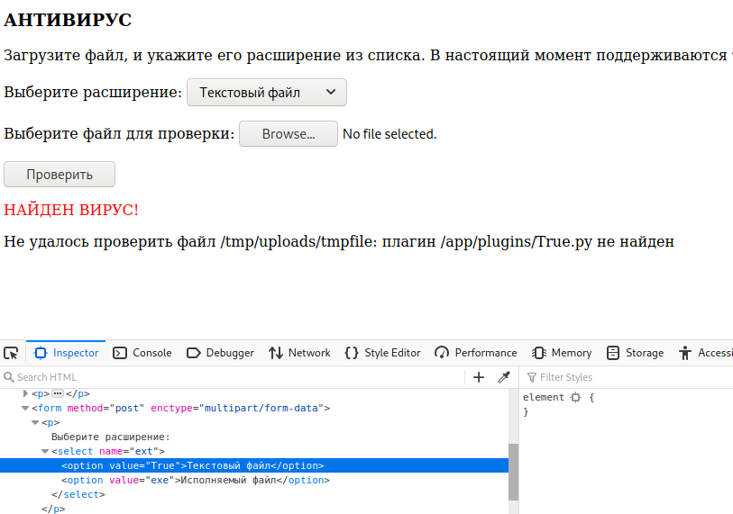
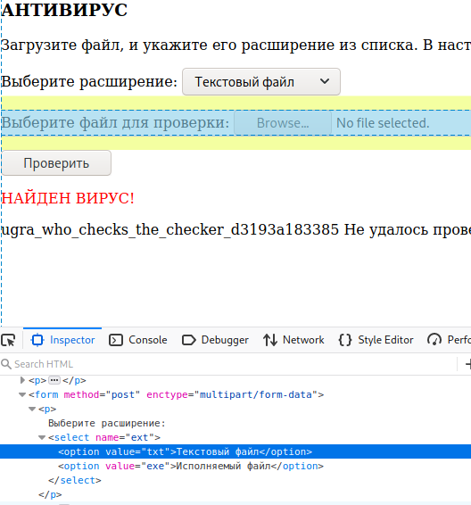

# UGRA CTF 2021
--------------------------------------

\
\
\
\


## Crypto 150 "Арбатско-Покровская линия?"

&NewLine;

https://q.2021.ugractf.ru/tasks/apl

It was given the following code in a unknown environment:

```sh
      ⎕IO ← 0
      A ← 'abcdefghijklmnopqrstuvwxy_1234567890'
      I ← (6 6 ⍴ 1 + ⍳6)+⍉(10 × 6 6 ⍴ 1 + ⍳6)
      S ← 6 6 ⍴ A
      E ← {⌈/⌈/ (~⍵ ⍳ S) × I}
      E¨flag
43 21 36 11 52 42 22 15 52 32 15 46 42 52 41 42 11 42 23 33 32 52 23 41 52 15 41 33 42 15 36 23 13 52 34 36 33 21 36 11 31 31 23 32 21 52 53 14 62 66 15 12 12 12 55 13 15 16 54 64 13 53 11 53 64 15 16 55 66 64 65 53 54 64 62 63 13 16 62 66 63 61 15 61 55 16 13 16 53 62 13 55 54 66 65 56 66 56 15 12 63 12 64 61

```

What is this strange code??

After some research, we get to know that it corresponds to a symbolic programming language, very good for creating one liner encryptions:

https://en.wikipedia.org/wiki/APL_(programming_language)

I found an online shell and started checking what this outputs

https://tio.run/#apl-dyalog-classic

Nothing interesting, just an error. 

I start studying how this language works, and find out the the code assigned to E is, at least, strange. I also find a way to see what is stored in the vars I and S:

```sh
11 12 13 14 15 16
21 22 23 24 25 26
31 32 33 34 35 36
41 42 43 44 45 46
51 52 53 54 55 56
61 62 63 64 65 66
abcdef
ghijkl
mnopqr
stuvwx
y_1234
567890
```

It could be a mapping to decode the hexa values given..?
I do a simple script, and it seems I was right )

```sh
ugra_the_next_station_is_esoteric_programming_1d60ebbb3cef28c1a18ef308912867cf6075e53fcf16c3209404eb7b85
```

--------------------------------------
&NewLine;

## Pwn 250 "Антивирус"

&NewLine;

https://q.2021.ugractf.ru/tasks/antivirus

I find a page for uploading a file and choosing file extension to be analyzed for an antivirus.

Playing with different inputs in the Multi-form, we find out some interesting output:

&NewLine;



&NewLine;

Playing a bit more we can make the paths coincide so the uploaded file is executed on the server side.
Creating a single script inside to show what is in /etc/passwd , the flag is there!

&NewLine;




